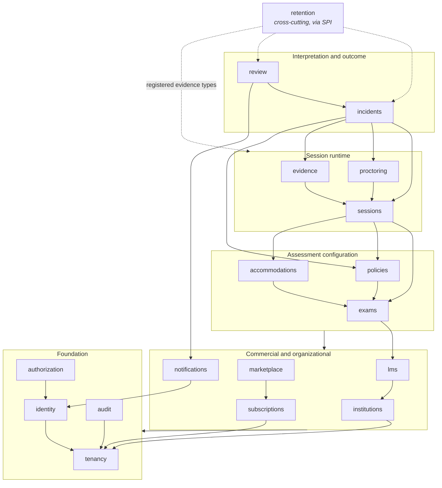

# Domain boundary map

Status: Milestone 0 baseline · 2026-08-12 · the target module structure for `services/api`.
Nothing here is implemented yet; Milestone 1 creates the modules and entities.

`services/api` is a modular monolith. "Modular" is a testable property, not a folder convention —
[§5](#5-how-the-boundaries-are-enforced) describes how it is enforced.

---

## 1. Modules and owned entities

Eighteen modules, thirty-five entities. Every entity has exactly one owning module; only that module
may write it.

| Module | Owns | Responsibility |
| --- | --- | --- |
| `tenancy` | `Tenant`, `TenantMembership` | Tenant registry; establishes and carries tenant context |
| `identity` | `User`, `ExternalIdentity`, `IdentityProvider` | Who someone is; LTI subject linking; staff IdP and per-tenant federation (ADR-002) |
| `authorization` | `Role`, `Permission` | What a principal may do, within a tenant |
| `institutions` | `Institution` | The customer organization; hierarchy and contact/branding data |
| `lms` | `LMSRegistration`, `LMSDeployment`, `CourseMapping` | LTI platform registrations, deployments, JWKS, course/user/role mapping |
| `exams` | `Exam` | Proctoring configuration bound to an LMS assessment (ADR-001 — not a question bank) |
| `policies` | `ExamPolicyVersion`, `ScoringPolicyVersion` | Versioned collection and review-priority policy; resolves effective policy |
| `accommodations` | `Accommodation` | Approved adjustments that **alter** detection and review policy before capture |
| `sessions` | `ProctoringSession`, `ConsentRecord` | Session lifecycle state machine; notice and consent capture; server-authoritative timing |
| `proctoring` | `ProctorAssignment`, `DetectionEvent`, `ModelVersion` | Live proctor assignment and console; raw detection intake; model registry |
| `evidence` | `MediaArtifact` | Media metadata, storage paths, upload/playback authorization. Never stores bytes |
| `incidents` | `Incident`, `IncidentEvidence`, `RiskAssessment` | Correlation of raw detections into interpreted incidents; review-priority assessment |
| `review` | `ReviewDecision` | Human review queue and decisions — the only determinations in the system |
| `retention` | `RetentionPolicyVersion`, `LegalHold` | Per-evidence-type schedules, holds, appeal extensions, deletion proof |
| `audit` | `AuditEvent` | Append-only record of sensitive actions; tamper-evident export |
| `marketplace` | `MarketplaceAccount`, `MarketplaceEntitlement` | Google Cloud Marketplace projection feeding the unified entitlement (ADR-003) |
| `subscriptions` | `Entitlement`, `SubscriptionPlan`, `CapacityQuota`, `UsageRecord` | Channel-neutral entitlements, capacity enforcement, metering |
| `notifications` | `Notification` | Pluggable, localized, tenant-scoped delivery of notices and alerts |

### Entities the gap register says are missing

[G-01 to G-03](assumptions-and-conflicts.md#open-gaps-for-later-milestones) identify three entities
that the specs require behaviourally but never name. When they are added, they belong here:

| Likely entity | Owning module | Required by |
| --- | --- | --- |
| `Appeal` | `review` (or a new `appeals` module) | Student dispute workflow, retention appeal extension |
| `IdentityVerification` | `identity` | Optional identity-proofing adapter and its deletion proof |
| `ChatMessage` | `proctoring` | Live proctor chat, which has its own retention schedule |

## 2. Dependency direction

Dependencies point downward only. There are no cycles.

**`retention` is deliberately not a layer.** If it imported every module that owns deletable data it
would depend on almost the whole system and become the thing nobody can change. Instead each module
that owns a retainable evidence type *registers* it with `retention` through a service-provider
interface — declaring its type name, how to enumerate expiring records, how to delete them, and how
to produce a deletion proof. `retention` schedules and orchestrates; it never reaches into another
module's tables.

**`audit` sits at the foundation and is written by everyone.** It depends only on `tenancy`, so any
module can emit an audit event without creating an upward dependency.

## 3. What crosses a boundary

Three mechanisms, in order of preference:

1. **Published events** (in-process domain events; Pub/Sub where the consumer is another service).
   The default for anything a downstream module reacts to: `SessionStarted`, `SessionCompleted`,
   `DetectionRecorded`, `IncidentRaised`, `ReviewDecisionRecorded`, `EntitlementChanged`,
   `RetentionScheduled`, `EvidenceDeleted`. Publishers do not know their consumers.
2. **A module's published API** — a narrow interface in the module's `api` package, taking and
   returning identifiers and DTOs. Used for synchronous queries a caller genuinely needs to complete
   its own transaction (for example, `sessions` resolving effective policy from `policies`).
3. **Nothing else.** No module reads another module's tables, no JPA relationship crosses a module
   boundary, and no entity class is imported across modules. Cross-module references are stored as
   UUID identifiers, not object references.

The cost of rule 3 is that some joins become two queries. That is the intended trade: it is what
makes an extraction possible later without a rewrite, and it prevents a lazy-loaded association from
quietly crossing a tenant boundary.

## 4. Invariants every module inherits

- **Tenant context** is established once per request, before any module runs, from a validated LTI
  launch or an authenticated staff session — never from browser-supplied input.
- **Every tenant-owned entity** carries an immutable `tenant_id`, and the repository layer applies
  scoping structurally. An unscoped repository method is a test failure.
- **Public identifiers** are non-sequential UUIDs; database sequence values are never exposed.
- **Optimistic locking** on every entity where concurrent modification is possible (sessions,
  incidents, review decisions, entitlements, policy activation).
- **Sensitive actions emit audit events** — evidence access and export, retention override, legal
  hold, entitlement change, impersonation start/stop, policy activation, permission change.
- **Raw detections are immutable.** Interpretation creates new records; it never edits detections.
- **Nothing user-facing is hard-coded English.** All strings are localizable keys.

## 5. How the boundaries are enforced

Enforced in Milestone 1 — a boundary that is only documented is not a boundary.

- **Package structure.** `com.falconexam.<module>`, each with a public `api` package and an
  `internal` package. Only `api` may be imported from outside the module.
- **Architecture tests.** ArchUnit rules in CI assert: no cycles between modules; no import of
  another module's `internal`; no entity class imported across modules; no JPA relationship crossing
  a module; every repository method tenant-scoped; only `audit` writes `audit_event`.
- **Schema ownership.** Flyway migrations are organized per module and each module's tables carry its
  prefix, so a foreign key across a boundary is visible in review.
- **Tests mirror the boundary.** Each module has its own test slice; cross-module behaviour is tested
  through published APIs and events, not by reaching into internals.

A change that needs to break one of these rules needs an ADR, not a suppression.

## 6. Boundaries with the other services

- **`services/ai`** receives analysis requests and returns raw detections. It never queries
  PostgreSQL, never resolves policy, and never decides whether an incident exists. It is given only
  what a detection needs, with tenant and session identifiers for correlation and isolation.
- **Media/retention workers** act on storage and on their own module's tables through the same
  published APIs the monolith uses. They are deployment units, not a fourth architecture.
- **`apps/web`** consumes the generated OpenAPI contract. It holds no authorization logic of its own —
  role-aware routing hides what a user cannot do, but the API is what enforces it.
