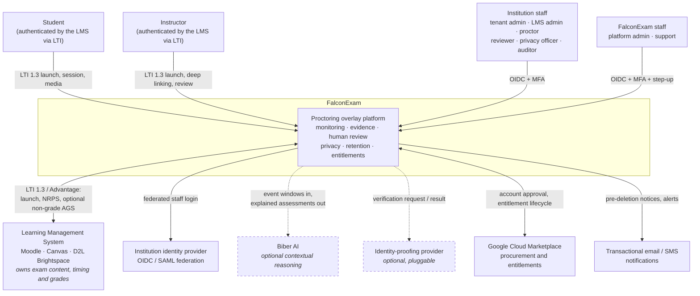
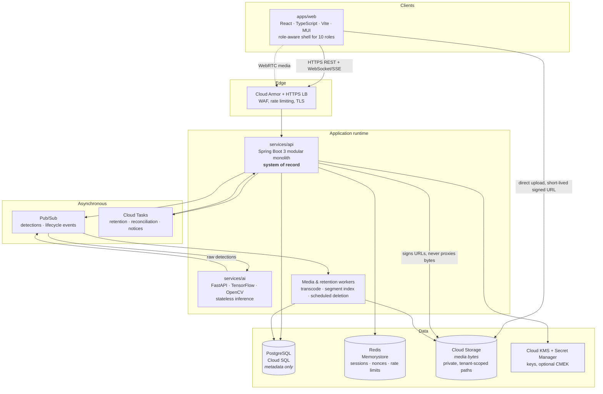
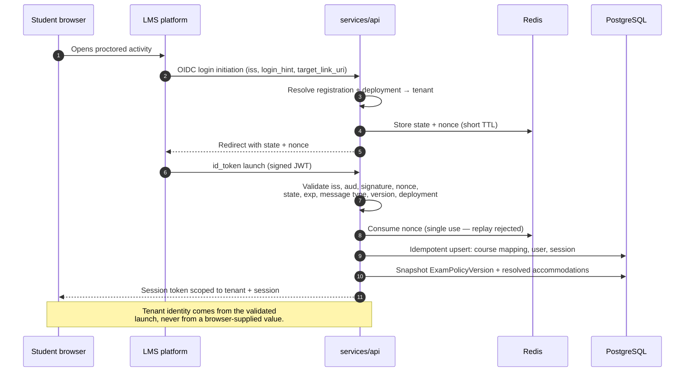
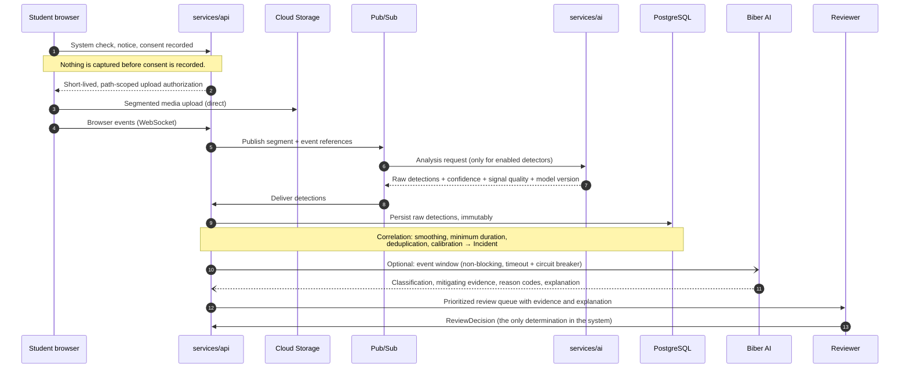

# FalconExam architecture overview

Status: Milestone 0 baseline · 2026-08-12 · describes the intended architecture, not what is built.
See [STATUS.md](../STATUS.md) for what actually exists.

FalconExam is a **proctoring overlay**: the LMS owns exam content, delivery, timing and grading, and
FalconExam observes the session, stores evidence, and supports human review (ADR-001). Every
architectural choice below follows from three constraints:

1. **A human always decides.** The system produces prioritized, explained evidence — never verdicts.
2. **Collection is optional and granular.** Six proctoring modes, each switchable at platform,
   tenant, course, exam and accommodation level, and recording / audio / identity / screen capture
   independently configurable. The architecture must make "collect nothing" a real code path, not a
   filter applied after collection.
3. **Tenant isolation is structural.** Enforced in application logic, repositories, object storage
   paths, cache keys, queues, logs and tests — not by a `WHERE` clause a developer might forget.

---

## 1. System context

Who and what FalconExam talks to.

Dashed edges are optional integrations that are **disabled until configured**. The platform must be
fully functional with both switched off — that is a contract test, not an aspiration.

## 2. Containers

**Three rules this diagram encodes:**

- Media bytes never pass through `services/api` and never enter PostgreSQL. The API mints
  short-lived, tenant/exam/session-scoped upload and playback authorizations; the browser talks to
  object storage directly. This keeps the API stateless and cheap to scale, and it keeps a single
  chokepoint for authorization.
- `services/ai` holds no durable state and no tenant data of its own. It receives work, returns raw
  detections, and forgets. It is the only component that may ever need GPU.
- Everything that can be slow, bursty or externally dependent (inference, transcoding, retention
  sweeps, Marketplace reconciliation, notifications) is asynchronous. A student's exam session must
  never block on any of it.

## 3. Request and evidence flows

### 3.1 LTI launch → proctoring session

### 3.2 Monitored session → evidence → human review

Raw detections are written once and never rewritten by interpretation. An `Incident` references
detections; it does not replace them. If Biber AI is off, unavailable or slow, the pipeline completes
without it and the reviewer sees an unenriched — but complete — queue.

## 4. Why a modular monolith

`services/api` is one deployable containing ~18 enforced modules
([domain-boundaries.md](domain-boundaries.md)). Only inference and media/retention work run
separately.

The reasons are specific, not stylistic:

- **Tenant isolation is easier to prove in one process.** One place where tenant context is
  established, one repository layer to test cross-tenant access against, one audit path. Distributing
  this early multiplies the surface where isolation can silently fail — the highest-severity risk in
  the threat model.
- **The transactional core is genuinely coupled.** Session, policy snapshot, incident, review
  decision, retention schedule and audit event change together and need real transactions. Splitting
  them buys distributed-transaction complexity and no scaling benefit.
- **The parts with a real scaling boundary are already separate.** Inference is CPU/GPU-bound and
  bursty; media processing is I/O-bound; both are async and stateless. Those are extracted on
  evidence, which is the standard the master-architect prompt sets.

Extracting any other module requires a demonstrated scaling or security boundary **and** an ADR.

## 5. Synchronous and asynchronous boundaries

| Path | Mode | Why |
| --- | --- | --- |
| LTI launch, authn/authz, policy resolution | Synchronous | The student is waiting; correctness gates the session |
| Session lifecycle, browser events, chat | Synchronous (WebSocket) | Live proctoring needs low latency |
| Media upload | Direct to storage | Bytes must not traverse the API |
| Detection, correlation, transcoding | Asynchronous (Pub/Sub) | Bursty and slow; must never block the exam |
| Biber AI enrichment | Asynchronous, non-blocking, circuit-broken | Optional by definition; degradation must be invisible to the student |
| Retention sweeps, pre-deletion notices | Scheduled (Cloud Tasks) | Time-driven, must survive restarts, must be idempotent |
| Marketplace reconciliation | Asynchronous, idempotent | Duplicate events are expected and must be harmless |

## 6. Tenancy model

- Every tenant-owned row carries an **immutable** `tenant_id`. Public identifiers are non-sequential
  UUIDs.
- Tenant context is derived from a validated LTI launch or an authenticated staff session, and is
  bound to the request at the edge of the application. It is never read from a header, query
  parameter or request body supplied by the browser.
- The repository layer applies tenant scoping structurally, so an unscoped query is a build- or
  test-time failure rather than a data leak.
- Object storage paths, Redis key prefixes, queue message attributes and log fields all carry the
  tenant, so isolation survives outside the database too.
- Cross-tenant access attempts are a tested behaviour (`tests/security`), not an assumed one.

Regional residency and institution-owned storage are supported by making the storage location a
tenant-level binding rather than a global setting — designed in Milestone 3, provisioned in
Milestone 6.

## 7. Environments

| Environment | Purpose |
| --- | --- |
| Local | Docker Compose: PostgreSQL, Redis, Cloud Storage emulator, mail catcher |
| dev | Shared integration, synthetic data only |
| test | Automated e2e, security and performance suites |
| UAT | Institution-facing validation with LMS test instances |
| prod | Customer data; isolated project, CMEK option, restricted access |

Environments are isolated Google Cloud projects with separate service accounts and no shared
credentials (Milestone 6). No production data is ever copied downward.

## 8. What this document does not yet cover

Deliberately deferred, with the milestone that owns each: detailed ERD (Milestone 1), LTI conformance
matrix (Milestone 2), media codec/segmentation specifics and the browser support matrix
(Milestone 3), model architecture and evaluation methodology (Milestone 4), full threat model with
tested mitigations (Milestone 5), Terraform topology and disaster recovery (Milestone 6).
