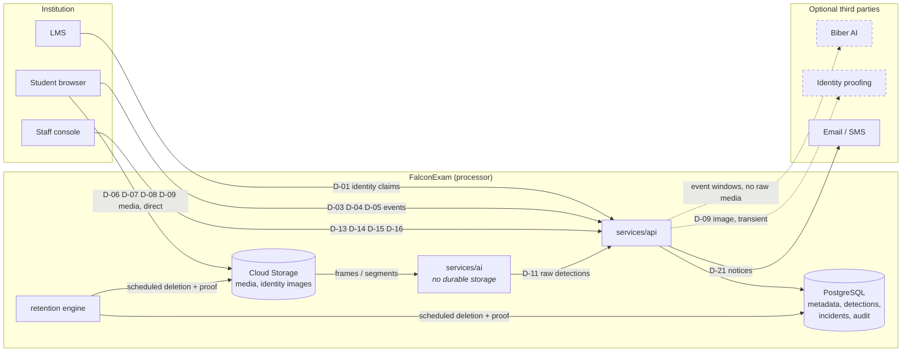

# Data-flow inventory

Status: **baseline** · Milestone 0 · 2026-08-12
Describes the data FalconExam is designed to process. **No data is processed yet** — no code exists.
Updated at every milestone, as the global acceptance checklist requires.

FalconExam is a **processor** acting on instructions from the institution, which is the controller.
This document does not assert compliance with any law. It is the factual record institutions need to
do their own assessment, and the reference the retention engine and privacy consoles are built from.

Three rules govern everything below:

1. **Nothing is collected that a configured mode does not require.** Disabling a mode must remove the
   collection path, not filter its output.
2. **Every category is independently configurable and independently scheduled for deletion.** There
   is no universal retention period.
3. **Nothing is captured before notice and consent/acknowledgement are recorded.**

---

## 1. Purpose inventory

| Purpose | Data used | Necessity |
| --- | --- | --- |
| Establish who is in the session | LTI identity claims; optionally identity images | Required (identity images optional) |
| Detect conditions the institution's policy defines as relevant | Video, audio, screen, browser events — per mode | Optional per mode |
| Give a human reviewer enough context to judge fairly | Detections, media segments, mitigating evidence | Required where any monitoring is enabled |
| Let a student see and dispute what was attributed to them | Incidents, evidence, appeal record | Required — due process |
| Prove what the platform and its users did | Audit events | Required |
| Enforce and bill contracted capacity | Usage records, entitlements | Required |
| Deliver notices and alerts | Contact identifiers, preferences | Required |

Any processing that does not map to a row above should not exist. Adding a row is a privacy decision
and needs an ADR.

## 2. Data categories

Sensitivity: **C** critical (biometric or biometric-adjacent), **H** high, **M** moderate, **L** low.
"Optional" means the institution can turn the collection off entirely and the platform still works.

| # | Category | Examples | Sens. | Optional | Collected when | Stored in | Retention owner |
| --- | --- | --- | --- | --- | --- | --- | --- |
| D-01 | LMS identity claims | LTI subject, name, email, roles, course/context | M | No | Every launch | PostgreSQL | `identity`, `lms` |
| D-02 | Staff account data | Staff identifiers, IdP subject, MFA state, role grants | M | No | Staff login | PostgreSQL | `identity` |
| D-03 | Notice and consent record | Policy version shown, timestamp, acknowledgement | M | No | Session start | PostgreSQL | `sessions` |
| D-04 | Session lifecycle | Start/stop, breaks, connection loss, device/browser summary | M | No | Any monitored session | PostgreSQL | `sessions` |
| D-05 | Browser events | Focus loss, fullscreen exit, paste, navigation | M | Yes (mode 2+) | Mode 2, 3, 6 | PostgreSQL | `sessions` |
| D-06 | Webcam video | Recorded segments | H | Yes | Modes 3–6 where recording enabled | Cloud Storage | `evidence` |
| D-07 | Screen capture | Recorded segments | H | Yes, independently of D-06 | Where enabled | Cloud Storage | `evidence` |
| D-08 | Audio | Recorded audio | H | Yes, independently | Where enabled and legally approved | Cloud Storage | `evidence` |
| D-09 | Identity images | ID document photo, live capture | **C** | Yes — off by default | Identity workflow only | Cloud Storage | `identity` |
| D-10 | Face embeddings | Derived vectors used for matching | **C** | Yes — off by default | Identity verification only | Transient; PostgreSQL only if explicitly retained | `identity` |
| D-11 | Raw detections | Type, start/end, confidence, signal quality, model version, bounding boxes | H | Yes (modes 3, 6) | Automated analysis | PostgreSQL (+ artifact refs) | `proctoring` |
| D-12 | Interpreted incidents | Correlated incident, linked evidence, review-priority assessment, reason codes | H | Yes | Where detection or manual flagging occurs | PostgreSQL | `incidents` |
| D-13 | Proctor–student chat | Live console messages | H | Yes | Modes 5, 6 | PostgreSQL | `proctoring` (see G-03) |
| D-14 | Proctor notes and warnings | Free text authored by a proctor | H | Yes | Modes 5, 6 | PostgreSQL | `proctoring` |
| D-15 | Reviewer decisions | Outcome, rationale, reviewer identity, timestamp | H | No, where review occurs | PostgreSQL | `review` |
| D-16 | Student appeals | Dispute text, status, outcome | H | No — due process | PostgreSQL | `review` (see G-01) |
| D-17 | Accommodation records | Approved adjustments affecting detection/review policy | **C** in effect — may reveal disability | No, where granted | PostgreSQL | `accommodations` |
| D-18 | Audit events | Actor, action, object, tenant, time, context | H | No | Every sensitive action | PostgreSQL, exportable | `audit` |
| D-19 | Usage and capacity | Concurrent sessions, storage, analysis counts | L | No | Continuous | PostgreSQL | `subscriptions` |
| D-20 | Entitlement and account | Plan, quota, Marketplace/contract references, billing contacts | L | No | Provisioning | PostgreSQL | `subscriptions`, `marketplace` |
| D-21 | Notification records | Recipient, channel, template, status, locale | M | No | On delivery | PostgreSQL | `notifications` |
| D-22 | Operational telemetry | Logs, metrics, traces | M | No | Continuous | Cloud Logging/Monitoring | Platform |

### Categories requiring specific care

- **D-09 / D-10 — identity images and embeddings.** Off by default. Embeddings are transient and
  deleted immediately after verification unless the institution explicitly configures retention;
  deletion produces a proof record. Accommodations may substitute an alternative verification method,
  and choosing it must not itself become a flag.
- **D-17 — accommodations.** These records can reveal disability. They are visible only to roles that
  must act on them, are never exposed to other students, and never appear in evidence shown to a
  reviewer as a justification for suspicion. They change detection policy *before* capture (G-05).
- **D-13 / D-14 — chat and notes.** Human-authored free text about a student. It is disclosable to
  the student under a data-subject request and must be written accordingly; the reviewer and proctor
  guides must say so.
- **D-22 — telemetry.** Must never contain launch tokens, signed URLs, media bytes, chat content or
  identity images. Enforced by log scrubbing (T-09).

## 3. Where data flows

**Biber AI never receives raw media.** It receives structured event windows and metadata. This is a
design constraint, not a configuration option — it limits what an optional third party can ever hold.

## 4. Processors and subprocessors

| Party | Role | Data | Status |
| --- | --- | --- | --- |
| Google Cloud (Cloud Run, Cloud SQL, Storage, Pub/Sub, KMS, Logging) | Infrastructure subprocessor | All categories at rest and in transit | Baseline |
| Biber AI | Optional processor | Structured event windows (D-11, D-12 context). No raw media | Off until configured |
| Identity-proofing provider | Optional processor | D-09 transiently | Off by default |
| Email/SMS provider | Optional processor | D-21 recipient and content | Required for email; SMS optional |

The published subprocessor inventory (Milestone 5) is generated from this table. Institution-owned
storage and regional residency change *where* D-06 to D-09 live, not who processes them.

## 5. Residency, encryption and institution-owned storage

- Storage region is a tenant-level binding, so a Canadian institution's media can stay in Canadian
  regions.
- Encryption at rest and in transit throughout; customer-managed encryption keys (CMEK) are an
  option, as is an institution-owned Google Cloud project and bucket.
- With institution-owned storage, FalconExam holds metadata and access authorization; the bytes
  remain in the institution's account, and deletion is a coordinated operation whose proof both sides
  can see.

## 6. Retention and deletion

There is no universal retention period, and none may be hard-coded. Each category above is scheduled
independently, by tenant, jurisdiction, evidence type, exam and investigation state. The engine
supports scheduled deletion, legal/investigation holds, appeal-period extension, optional deletion
approval, proof-of-deletion records, storage lifecycle synchronization, per-session policy snapshots,
institution templates, and pre-deletion notification.

An active legal hold or an open appeal blocks deletion. Every deletion emits an audit event and a
proof record that survives the data.

## 7. Student rights

Students can see the incidents and evidence attributed to their own sessions (subject to tenant
configuration and active investigations), submit an appeal that is routed, audited and extends
retention, and see the appeal's status and outcome. Data subject access, export and deletion requests
route through the privacy officer console with full audit. Milestone 5 implements this; the entity to
back appeals does not exist yet (G-01).

## 8. Open items

| Item | Owner |
| --- | --- |
| G-01 appeal entity — required before the appeal flow or its retention extension can exist | Milestone 1/5 |
| G-02 identity-verification entity — required to record and prove D-09/D-10 deletion | Milestone 1/5 |
| G-03 chat entity — required for D-13's separate retention schedule | Milestone 1/3 |
| Per-jurisdiction default retention templates | Milestone 5 |
| Published subprocessor inventory and student-facing data-use notice | Milestone 5 |
