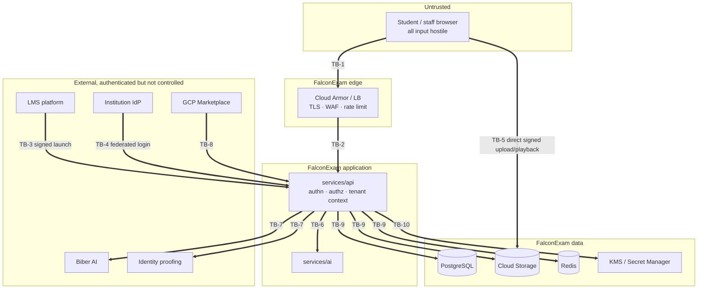

# FalconExam threat model

Status: **skeleton** · Milestone 0 · 2026-08-12
Every mitigation below is `Planned`. Nothing in this document has been implemented or tested yet.

This is a living document. The global acceptance checklist requires it to be updated for new attack
surfaces at every milestone, and Milestone 5 requires each surface listed here to have a
corresponding test in `tests/security`. **A surface with no test is an open finding, not a control.**

Method: STRIDE applied per trust boundary, plus a register of the concrete attack surfaces named in
the specifications. Each register entry names the milestone that owns it, so the model cannot quietly
outrun the code.

---

## 1. What we are protecting

| Asset | Sensitivity | Why an attacker wants it |
| --- | --- | --- |
| Webcam / screen / audio recordings | Highest — biometric-adjacent, of minors in K-12 tenants | Direct privacy harm, extortion, public embarrassment |
| Identity images and face embeddings | Highest — biometric | Identity theft; disproportionate harm; may be regulated as biometric data |
| Raw detections and incidents | High — can imply accusation | Reputational harm to a student; leverage over an institution |
| Reviewer decisions and appeals | High — due-process record | Tampering changes an academic outcome |
| Audit log | High — the record of everything else | Erasing it hides every other attack |
| LTI signing keys, platform registrations | Critical | Forging launches means impersonating any student in a tenant |
| Cross-tenant data as an aggregate | Critical | One breach becomes every institution's breach |
| Entitlements and capacity | Moderate | Free or unbounded service; cost attack on FalconExam |

**Blast-radius principle:** a single failure must never expose more than one tenant, and within a
tenant, no more than the sessions the compromised principal legitimately reaches.

## 2. Actors, including the ones we must design against

| Actor | Trusted for | Explicitly not trusted for |
| --- | --- | --- |
| Student | Nothing. All client input is hostile | Timestamps, tenant/session identity, event completeness, media integrity |
| Instructor | Their own courses via LTI | Access to other courses or tenants; changing evidence |
| Proctor | Live sessions assigned to them | Browsing unassigned students; retaining or exporting media |
| Reviewer | Deciding on assigned incidents | Altering raw detections or the audit trail |
| Tenant / LMS admin | Configuring their tenant | Cross-tenant reach; disabling audit; silent policy backdating |
| Privacy officer / auditor | Reading, exporting, and deletion governance | Unaudited or unbounded export |
| FalconExam support | Time-boxed, consented, audited impersonation | Standing access; silent login; access without a ticket |
| Platform admin | Platform operations | Unilateral access to tenant evidence without audit |
| LMS platform | A validated, signed launch | Anything unsigned, replayed, or from an unregistered issuer |
| Biber AI / identity providers | A schema-valid response, on time | Availability; being on the critical path; unvalidated content |

Insider and privileged-role abuse is a first-class threat here, not an afterthought: a proctor
watching students they were never assigned, and support staff logging in "to help," are the two most
likely real-world incidents this product will face.

## 3. Trust boundaries

| ID | Boundary | Primary STRIDE concerns |
| --- | --- | --- |
| TB-1 | Browser → edge | Spoofing, Tampering, DoS |
| TB-2 | Edge → application | Elevation of privilege, Information disclosure |
| TB-3 | LMS → application (LTI) | Spoofing, Tampering, Repudiation |
| TB-4 | IdP → application (staff) | Spoofing, Elevation of privilege |
| TB-5 | Browser → object storage | Information disclosure, Tampering |
| TB-6 | Application → AI service | Tampering, DoS, Information disclosure |
| TB-7 | Application → optional third parties | Information disclosure, DoS, Tampering (of returned content) |
| TB-8 | Marketplace → application | Spoofing, Repudiation |
| TB-9 | Application → data stores | Information disclosure, Elevation of privilege |
| TB-10 | Application → secrets/keys | Elevation of privilege |

## 4. Attack surface register

Status is `Planned` for every row until the owning milestone implements **and tests** it.
`Test` names the suite that will constitute evidence.

### Tenancy and authorization

| ID | Surface | Threat | Planned mitigation | Test | Milestone | Status |
| --- | --- | --- | --- | --- | --- | --- |
| T-01 | Cross-tenant data access | Any authenticated principal reads another tenant's data | Tenant context derived server-side only; structural repository scoping; tenant in storage paths, cache keys, queue attributes; ArchUnit rule against unscoped queries | `tests/security` cross-tenant matrix over every endpoint | 1 | Planned |
| T-02 | IDOR on evidence, sessions, incidents | Guessable or substituted identifiers expose others' records | Non-sequential UUIDs; authorization on every object load, not just the route; deny by default | Per-role IDOR sweep | 1, 3 | Planned |
| T-03 | Privilege escalation via role or membership edit | User grants themselves a privileged role | Role changes are privileged, step-up gated and audited; no self-elevation; separation between tenant and platform scopes | Authorization tests | 1 | Planned |
| T-04 | Tenant context supplied by the client | Header, query param or body sets the tenant | Tenant never read from request input; rejected and audited if present | Negative test asserting client-supplied tenant is ignored | 1 | Planned |

### LTI and LMS integration

| ID | Surface | Threat | Planned mitigation | Test | Milestone | Status |
| --- | --- | --- | --- | --- | --- | --- |
| T-05 | LTI launch replay | A captured `id_token` is replayed to open a session | Single-use nonce with short TTL in Redis; state binding; `exp`/`iat` enforcement; idempotent session creation | Replay and nonce-reuse tests per platform | 2 | Planned |
| T-06 | JWT tampering / forged launch | Altered claims or an unregistered issuer grants access | Full validation: `iss`, `aud`, signature against platform JWKS, nonce, state, `exp`, message type, version, deployment | Conformance fixtures for Moodle, Canvas, Brightspace | 2 | Planned |
| T-07 | Compromised or malicious LMS registration | A registration is pointed at an attacker-controlled platform | Registration changes are privileged, step-up gated and audited; redirect URI allowlist; deployment→tenant mapping validated | Registration tampering test | 2 | Planned |
| T-08 | SSRF via platform key retrieval | JWKS URL points at internal metadata endpoints | Outbound allowlist; block private/link-local ranges; no redirect following to new hosts; short timeouts | SSRF suite against key retrieval | 2 | Planned |
| T-09 | Launch token in logs | Tokens leak through application or platform logs | Structured logging with a deny-list; token-shaped value redaction; log review in CI | Log-scrubbing assertion tests | 2 | Planned |

### Media and evidence

| ID | Surface | Threat | Planned mitigation | Test | Milestone | Status |
| --- | --- | --- | --- | --- | --- | --- |
| T-10 | Media URL leakage | A signed playback URL is shared, logged or cached and replays later | Short expiry; per-object, per-principal scoping; never logged; no public buckets; revocation on hold/delete | Expiry and reuse tests, **also against real GCS** (see A-03) | 3 | Planned |
| T-11 | Malicious upload | Crafted media exploits transcode/inference, or is used to store hostile content | Content-type and size limits at signing time; process media in an isolated worker; no execution from storage; scan before playback | Malicious-file corpus test | 3 | Planned |
| T-12 | Cross-session object access | Path traversal or guessed object keys reach another session's media | Tenant/exam/session-scoped paths; authorization at signing time; storage IAM denies broad reads | Path isolation tests | 3 | Planned |
| T-13 | WebSocket / WebRTC authorization | Unauthorized subscription to a live stream or event channel | Authorize on connect **and** per subscription; bind to session and assignment; expire with the session | Live-channel authorization tests | 3 | Planned |
| T-14 | Evidence tampering | Detections or media altered to strengthen or weaken a case | Raw detections immutable; interpretation stored separately; object versioning; integrity hashes; every access audited | Immutability and audit tests | 3, 4 | Planned |

### Human abuse of legitimate access

| ID | Surface | Threat | Planned mitigation | Test | Milestone | Status |
| --- | --- | --- | --- | --- | --- | --- |
| T-15 | Proctor abuse | A proctor views, records or shares students they were not assigned | Access strictly scoped to active assignments; time-bounded; every view audited; anomaly reporting for volume and off-hours access | Assignment-scope tests + audit assertions | 3 | Planned |
| T-16 | Support impersonation | Silent or standing login into a tenant | Explicit, consented, time-boxed, single-tenant scope; MFA and step-up; clear start/stop audit events; visible to the tenant | Impersonation lifecycle and audit tests | 1, 5 | Planned |
| T-17 | Bulk evidence export | Legitimate export privileges used to exfiltrate at scale | Step-up auth; volume limits and alerting; export watermarking and full audit; privacy-officer visibility | Export control tests | 5 | Planned |
| T-18 | Audit tampering | Records of the above are deleted or edited | Append-only from the application; no update/delete paths; tamper-evident export; database grants deny mutation | Append-only enforcement tests | 1, 5 | Planned |

### AI pipeline

| ID | Surface | Threat | Planned mitigation | Test | Milestone | Status |
| --- | --- | --- | --- | --- | --- | --- |
| T-19 | Model-input abuse | Crafted frames or audio trigger false detections against a targeted student, or crash the pipeline | Input validation and bounds; per-session rate limits; signal-quality gating; failures degrade to "no detection", never to "incident" | Adversarial-input tests | 4 | Planned |
| T-20 | Untrusted third-party AI response | Biber AI returns oversized, malformed or injected content that is rendered to a reviewer | Strict schema validation; size caps; treat all text as untrusted data and escape on render; timeout and circuit breaker; disabled by default | Adapter contract and injection tests | 4 | Planned |
| T-21 | Denial of service via inference cost | Session volume or crafted load exhausts inference capacity | Capacity enforced from `CapacityQuota`; queue backpressure; per-tenant fairness; graceful degradation to record-and-review | Load and backpressure tests | 4, 6 | Planned |

### Platform and supply chain

| ID | Surface | Threat | Planned mitigation | Test | Milestone | Status |
| --- | --- | --- | --- | --- | --- | --- |
| T-22 | Supply-chain compromise | A malicious or vulnerable dependency or base image reaches production | Pinned dependencies; SBOM per build; dependency and container scanning as a release gate; provenance for internal artifacts | CI gates in Milestone 7 | 5, 7 | Planned |
| T-23 | Secret exposure | Credentials in the repository, logs, or images | `.gitignore` for env/keys; secret scanning in CI; Secret Manager at runtime; no secrets in images or environment dumps | Secret scan job (skeleton exists) | 0, 5 | Planned |
| T-24 | Marketplace event forgery / replay | Forged or duplicated entitlement events grant or revoke capacity | Trusted server-side integration only; verified caller; idempotent reconciliation keyed on event identity; never trust a browser claim | Duplicate/forged event tests | 6 | Planned |
| T-25 | Web application classics (XSS, CSRF, SQLi, clickjacking) | Standard exploitation of the consoles | CSP, HSTS, `SameSite` cookies, CSRF tokens, parameterized queries, output escaping, frame-ancestors — noting LTI launches legitimately run framed, so framing policy must be per-route | OWASP-aligned suite | 1, 5 | Planned |
| T-26 | Session hijacking of privileged consoles | A stolen staff session yields standing access | Short privileged sessions; MFA; step-up for sensitive actions; binding and revocation; no shared accounts | Session lifecycle tests | 1 | Planned |

## 5. Explicitly out of scope

Stating these honestly is a security control in itself — overclaiming is how institutions end up
trusting a boundary that does not exist.

- **Device-level control.** FalconExam is not a lockdown browser. It cannot reliably detect all
  external devices, virtual machines, secondary screens, phones out of frame, or a person off camera.
  Documentation must say so plainly.
- **Determining misconduct.** The system produces evidence; a human decides. There is no threat model
  entry for "AI reaches the wrong verdict" because the AI reaches no verdict.
- **Physical exam-room security**, which belongs to the institution.
- **The institution's own LMS security.** A fully compromised LMS can issue valid launches; the
  mitigation is registration governance and audit, not detection.

## 6. Review cadence

- Updated at every milestone for new surfaces (global acceptance checklist).
- Milestone 5 turns every `Planned` row into an implemented, tested control and records residual
  risk.
- Milestone 7 makes the model a release gate and folds it into the security-questionnaire evidence
  index.
